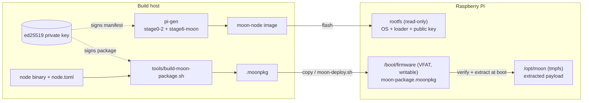
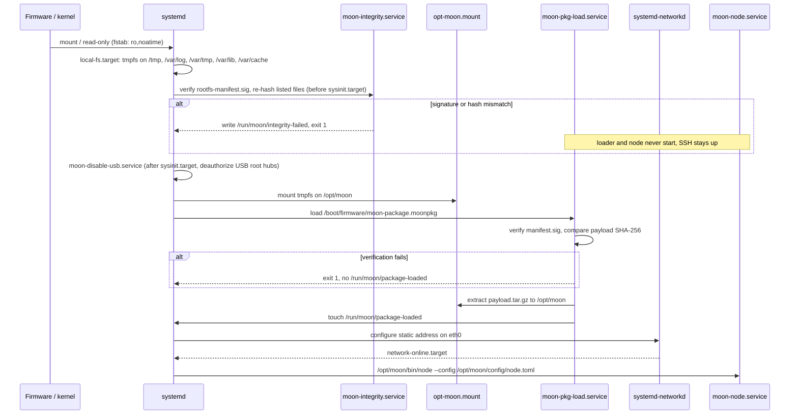

# Architecture

## Design goals

The image is the operating system platform for the nodes of an M-out-of-N
(MooN) voting cluster, in the thesis a 2oo3 system for ETCS brake curve
calculation on Raspberry Pi 4. The design follows five goals.

1. **One image for all nodes.** The image contains nothing node-specific. Node
   binary, node configuration and node identity arrive in a separate package.
   Adding a node or changing the topology never requires a new image.
2. **Deterministic state after every boot.** The root filesystem is read-only
   and all runtime state lives in RAM. A node always boots into the state that
   was flashed plus the package that is currently on the boot partition.
3. **Nothing unverified is executed by the node process.** The operating system
   files that control package loading and the package itself are both covered
   by ed25519 signatures that are checked at every boot.
4. **Minimal attack and fault surface.** WLAN, Bluetooth, HDMI and USB are
   disabled. There is no DHCP, no DNS, no cloud-init and no dynamic network
   management.
5. **Low effort, no irreversible hardware changes.** Mechanisms that need OTP
   fuses (Secure Boot) or major rework of the pi-gen export pipeline
   (dm-verity) are out of scope. See [security.md](security.md).

## Image and package split

| Artifact | Contains | Changes when |
|---|---|---|
| Image | Raspberry Pi OS Lite, hardening, static network template, loader services, public key, signed rootfs manifest | the platform changes (rare) |
| Package (`.moonpkg`) | `bin/node`, `config/node.toml`, anything else below `/opt/moon` | the framework, the node configuration or the node role changes |
| Per-node network file | static IP of the node | a node is re-addressed (via `moon-deploy.sh --ip`) |

The static IP is the only per-node parameter that lives on the root
filesystem. It is set at build time from `MOON_ETH_ADDRESS` and can be changed
on a running node with `tools/moon-deploy.sh`. It is deliberately excluded from
the integrity manifest.

## Boot sequence

Each step gates the next one twice, once through systemd dependencies and once
through a flag file in `/run/moon`.

| Gate | systemd mechanism | Flag file |
|---|---|---|
| Integrity check before loader | `moon-pkg-load.service`: `Requires=` + `After=moon-integrity.service` | loader aborts if `/run/moon/integrity-failed` exists |
| Loader before node | `moon-node.service`: `Requires=` + `After=moon-pkg-load.service` | `ConditionPathExists=/run/moon/package-loaded` |
| Package present | `ConditionPathExists=/boot/firmware/moon-package.moonpkg` on the loader | none, the node condition above covers it |

If no package is present, the loader is skipped (a failed condition is not an
error in systemd), the flag file is never created and the node service is
skipped as well. The system is still reachable over SSH in every one of these
failure cases, which keeps a misconfigured node debuggable without a console.

## Filesystem layout at runtime

| Path | Backing | Writable | Persistent | Purpose |
|---|---|---|---|---|
| `/` | ext4, rootfs partition | no (`ro`) | yes | operating system as flashed |
| `/boot/firmware` | VFAT, boot partition | yes | yes | firmware, `config.txt`, `cmdline.txt`, `moon-package.moonpkg` |
| `/opt/moon` | tmpfs | yes | no | extracted package, node logs |
| `/run`, `/run/moon` | tmpfs (systemd default) | yes | no | flag files of the boot chain |
| `/tmp` | tmpfs, 10 % RAM | yes | no | temporary files |
| `/var/lib` | tmpfs, 10 % RAM | yes | no | service state (`StateDirectory=`) |
| `/var/log`, `/var/tmp`, `/var/cache` | tmpfs, 5 % RAM each | yes | no | logs, temp files, caches |
| `/home`, `/root` | rootfs | no | yes | see known limitation below |

The journal is configured with `Storage=volatile`, so logs of a boot are lost
on power-off. Node logs are written to `/opt/moon/logs/`, which is also RAM
only.

**Known limitation.** `/home` and `/root` are not on tmpfs. A tmpfs would start
empty and break the login of the first user without an additional
`tmpfiles.d` rule. Consequently any write into a home directory fails, for
example `~/.ssh/known_hosts` when an outgoing SSH connection is made from a
node.

## Persistence model

There is no package cache, no A/B slot and no rollback. Every boot verifies
and extracts `/boot/firmware/moon-package.moonpkg` again from scratch. Replacing
that single file and restarting the loader (or rebooting) is the complete
software update mechanism. Rolling back means copying the previous package
back.

## Relation to the MooN framework

| Framework aspect | Provided by the image |
|---|---|
| Binary `node`, CLI `node --config <path>` | started by `moon-node.service` from `/opt/moon/bin/node` |
| Configuration file with its own SHA-256 check (`[integrity].checksum`) | shipped inside the package, the framework check is independent of the package signature |
| UDP multicast `239.10.0.x`, TTL 1, interface-bound | IPv4 address on `eth0` via `systemd-networkd`, gateway optional |
| Debug vs. production build (Cargo feature `diagnostic`) | selected by which binary is put into the package, the image is the same |
| Cross-compile target `aarch64-unknown-linux-gnu` | 64-bit userland from the pi-gen `arm64` branch |
