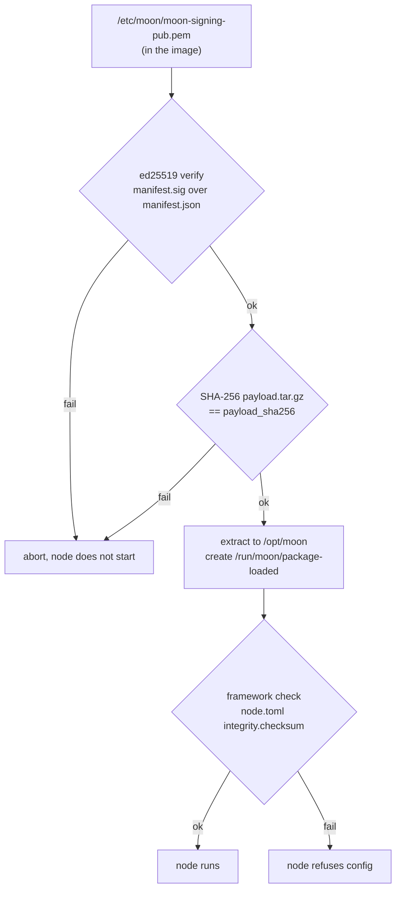

# Package format (`.moonpkg`)

A `.moonpkg` carries everything node-specific: the framework binary, the node
configuration and any further runtime files. It is placed on the boot
partition as `/boot/firmware/moon-package.moonpkg` and loaded at every boot by
`moon-pkg-load.service`.

## Container

An uncompressed POSIX tar archive with exactly three members.

| Member | Content |
|---|---|
| `manifest.json` | metadata and payload hash, see below |
| `manifest.sig` | raw 64-byte ed25519 signature over the bytes of `manifest.json` |
| `payload.tar.gz` | gzip-compressed tar, extracted verbatim into `/opt/moon` |

### manifest.json

```json
{"name":"moon-node","version":"1.0.0","created":"2026-09-01T12:00:00Z","payload_sha256":"<64 hex digits>"}
```

| Field | Type | Used by the loader |
|---|---|---|
| `name` | string | logged only |
| `version` | string | logged only |
| `created` | ISO 8601 UTC timestamp | not evaluated |
| `payload_sha256` | lowercase hex SHA-256 of `payload.tar.gz` | **mandatory**, compared before extraction |

### Payload layout

The payload root becomes `/opt/moon`. `moon-node.service` expects at least:

```
bin/node              framework binary (aarch64-unknown-linux-gnu), executable
config/node.toml      node configuration passed via --config
```

`logs/` is created by the service itself (`ExecStartPre=mkdir -p /opt/moon/logs`).

## Chain of trust



The signature covers only the small manifest, which in turn fixes the payload
by its hash. The node configuration has its own SHA-256 checksum field
(`[integrity].checksum`, checked by `NodeConfig::verify_and_parse` in the
framework). That check is independent of the package signature: the package
signature proves origin, the config checksum detects inconsistent edits of the
configuration itself. After editing a `node.toml` the checksum has to be
refreshed before the package is built.

## Building a package

```bash
tools/build-moon-package.sh \
  -k keys/moon-signing-key.pem \
  -n moon-node \
  -v 1.0.0 \
  -p ./payload \
  -o build/moon-node-1.0.0.moonpkg
```

| Option | Meaning |
|---|---|
| `-k` | ed25519 private key (PEM), same key as `MOON_SIGNING_PRIVKEY` |
| `-n` | package name, written to the manifest |
| `-v` | package version, written to the manifest |
| `-p` | payload directory, its content becomes the root of `/opt/moon` |
| `-o` | output file |

The tool packs the payload directory, hashes it, writes the manifest, signs it
and writes the tar container. The private key is used only locally.

A typical payload for one node of a 2oo3 cluster:

```bash
cargo build --release --target aarch64-unknown-linux-gnu            # production
# cargo build --release --target aarch64-unknown-linux-gnu --features diagnostic   # debug
mkdir -p payload/bin payload/config
cp target/aarch64-unknown-linux-gnu/release/node payload/bin/
cp configs/node-a.toml payload/config/node.toml
chmod 755 payload/bin/node
```

One package is built per node (identity and configuration differ), all of them
run on the same image.

## Inspecting a package

```bash
tar -tvf moon-node.moonpkg
tar -xOf moon-node.moonpkg manifest.json | jq .
# verify on the host
tar -xf moon-node.moonpkg -C /tmp/pkg
openssl pkeyutl -verify -pubin -inkey keys/moon-signing-pub.pem -rawin \
  -in /tmp/pkg/manifest.json -sigfile /tmp/pkg/manifest.sig
sha256sum /tmp/pkg/payload.tar.gz
```

## Deliberate limitations

| Limitation | Consequence |
|---|---|
| No version or rollback check | an older correctly signed package is accepted (downgrade possible) |
| No binding to a node or topology | a correctly signed package for node A also loads on node B |
| One key for image manifest and packages | a leaked key compromises both, see [security.md](security.md) |
| No debug/production distinction in the loader | the variant is decided by which binary is packed |
