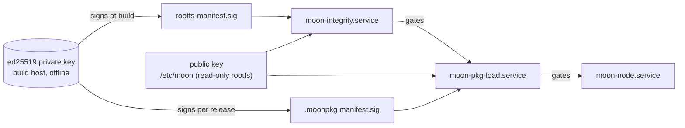

# Security model

## Scope

The image targets a laboratory and test setup: a closed Ethernet segment with
a small number of Raspberry Pi nodes running the MooN framework. The measures
aim at **integrity of the software that runs on a node** and at
**reproducible node state**, not at confidentiality and not at resistance
against an attacker with physical access. Measures of a certified railway
product (Secure Boot, measured boot, hardware security modules, per-device
credentials) are discussed below as extensions.

## Protection layers

| Layer | Mechanism | Protects against | Does not protect against |
|---|---|---|---|
| Reduced interfaces | WLAN, BT, HDMI off, USB deauthorized, cloud-init removed | unintended input paths, accidental peripherals | a root user re-enabling them |
| Read-only rootfs | `ro` mount, runtime paths on tmpfs, `ProtectSystem=strict` | accidental or ordinary writes, state drift between boots | `mount -o remount,rw /` by root |
| Rootfs integrity | signed SHA-256 manifest over a curated file list, checked at boot | persistent modification of the tracked files | modification of untracked files, modification of the SD card combined with a matching key |
| Package integrity | ed25519 signature over manifest, payload hash | execution of unsigned or altered node software | replay of an older signed package |
| Config integrity | framework checksum in `node.toml` | inconsistent configuration edits | deliberate edit with refreshed checksum (not a signature) |

## Trust chain

The public key is itself one of the tracked files, and it is used to verify
the manifest that tracks it. This detects a replaced key only together with a
manifest that was not re-signed with the matching private key. The anchor of
the chain is ultimately the unmodified SD card. Without a hardware root of
trust (Secure Boot) this cannot be closed, and this is accepted in scope.

## Key handling

`tools/gen-moon-keys.sh <dir>` creates `moon-signing-key.pem` (mode 600) and
`moon-signing-pub.pem` (mode 644). It refuses to overwrite an existing private
key.

| Key | Needed by | Lives |
|---|---|---|
| public | `03-moon-package-service` (copied into the image) | build host, image |
| private | `05-image-integrity`, `tools/build-moon-package.sh`, `tools/moon-deploy.sh --signing-key` | build host only, never in the image, never in version control |

The private key must be excluded from version control. `config` is ignored by
`.gitignore`, the `keys/` directory is not. Add `keys/*-key.pem` to
`.gitignore` and keep the private key out of the repository history.

Changing the key requires a new image (new public key and newly signed
manifest) and re-signing every package.

## Accepted trade-offs

| Trade-off | Reason | Consequence |
|---|---|---|
| SSH password authentication with a shared default password | simple access to all nodes in the test setup | only acceptable on an isolated network, the login banner states this |
| Shared SSH host keys and `/etc/machine-id` for all cards from one image | `/etc` is read-only, first-boot generation is impossible | nodes cannot be told apart at SSH or OS level, every rebuild changes the keys (clients will warn about changed host keys) |
| Curated file list instead of full rootfs hashing | short boot time, no change to the pi-gen export pipeline | untracked files are not covered |
| No package downgrade protection | no persistent state to store a counter in | an older signed package can be deployed |
| Static network file outside the manifest | per-node value, changed by `moon-deploy.sh` | the address of a node can be changed without detection |
| One signing key for image and packages | simpler key management for a single developer | a leak compromises both, separate keys are a straightforward extension |
| `PASSWORDLESS_SUDO=1` | `moon-deploy.sh` runs `sudo` non-interactively over SSH | the default password grants root |

## Rejected alternatives

### Secure Boot

The Raspberry Pi 4 and 5 support a signed boot chain, but enabling it
programs one-time-programmable fuses in the SoC. This cannot be undone and
would permanently bind the evaluation boards to one key. Together with the
effort for a signed boot image this was out of scope for the thesis. It is the
natural extension that would anchor the trust chain in hardware.

### dm-verity

dm-verity would provide a cryptographic block-level guarantee for the whole
rootfs. It would require:

* the rootfs as a separate, block-aligned partition plus a hash-tree partition,
  which the single boot+root layout of pi-gen's `export-image` does not
  provide,
* a `veritysetup format` pass against the exported image, which is a
  post-export step outside the pi-gen stage model,
* the root hash on the kernel command line, and
* an initramfs that sets up and enforces verity before switching to the real
  root.

The read-only mount combined with the signed boot-time hash check reaches the
practical goal (nothing on the rootfs changes across boots by accident, the
security-relevant files are verified) at a fraction of the effort. The price
is that the guarantee is mount-level plus a curated file check, not
block-level.

### Asymmetric debug/production verification

A planned refinement is a production image that only accepts signed packages
and a debug image that also accepts unsigned ones. Production packages could
then be tested on debug nodes while debug packages would be rejected by
production nodes. This is not implemented in the current stage. There is one
image variant, and it requires a valid signature for every package.
